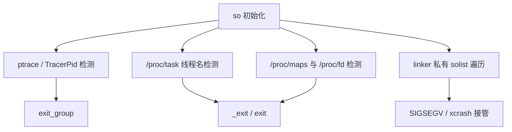
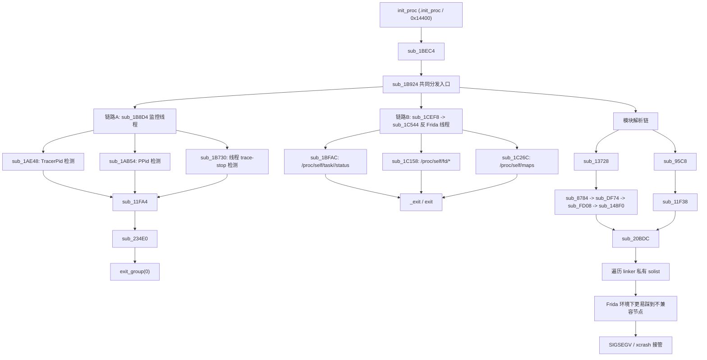
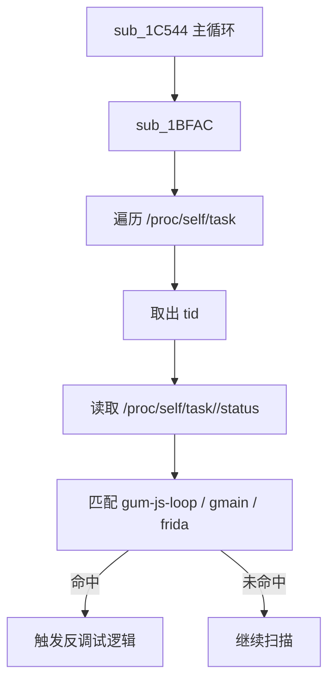
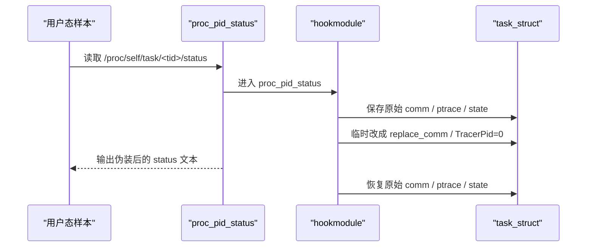
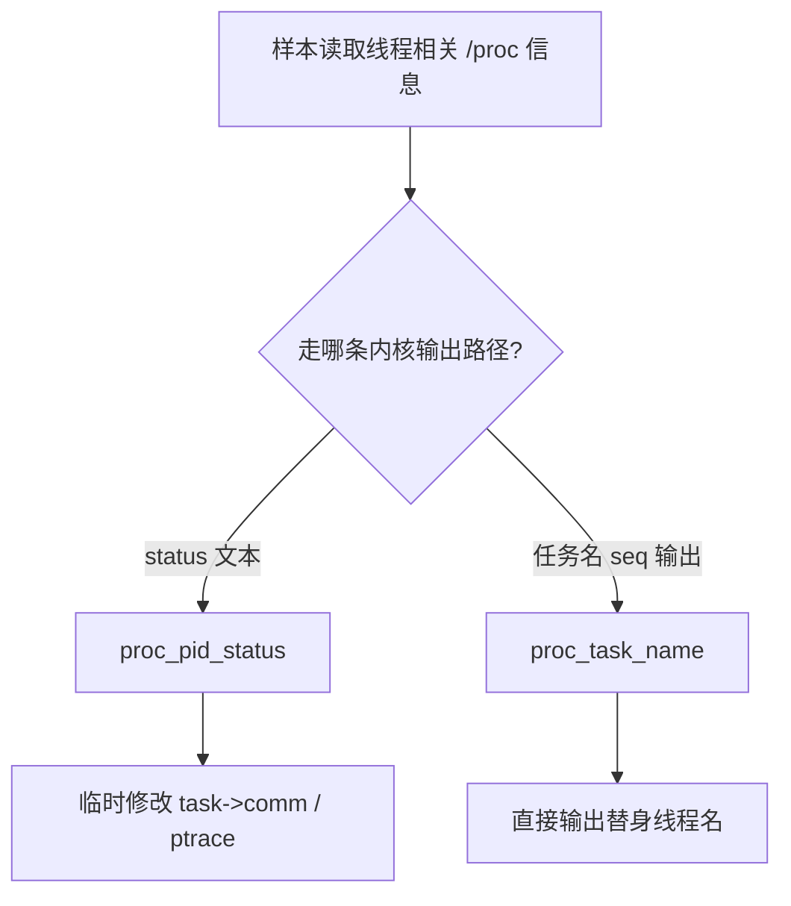
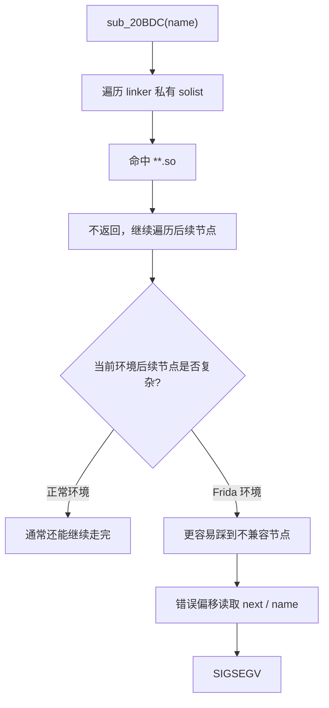
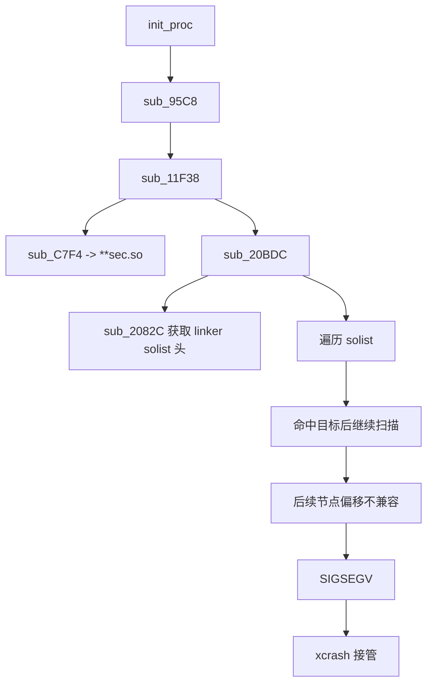
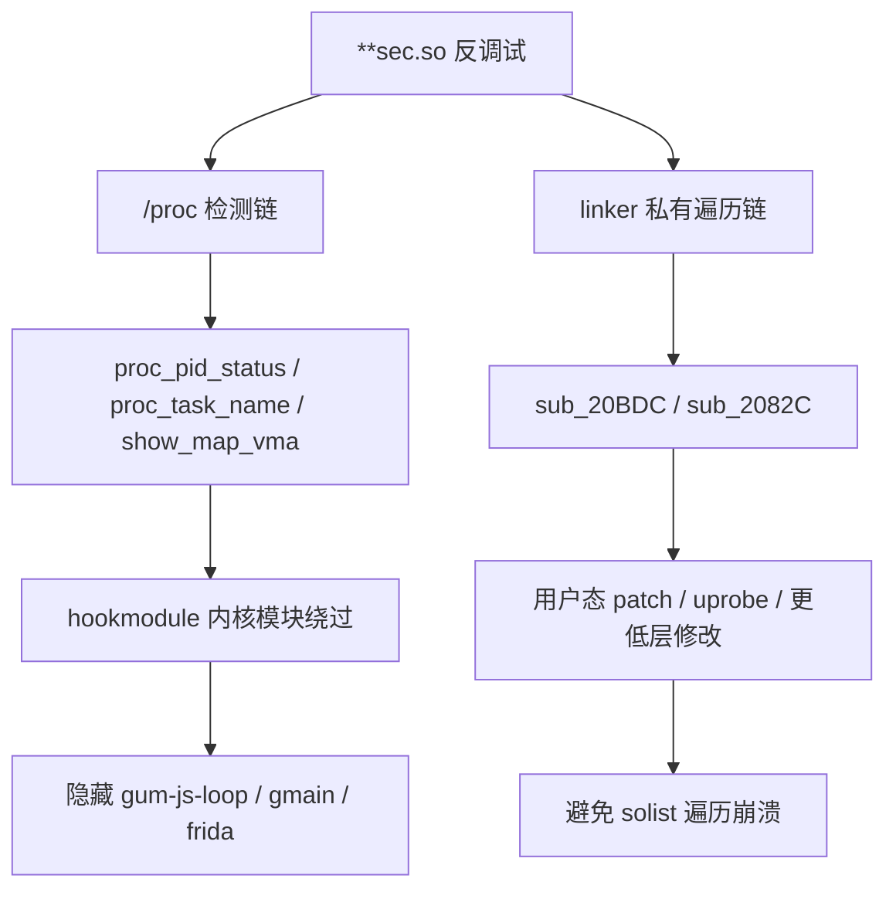

# 某sec.so反调试分析：AI静态分析+内核模块隐藏 Frida 特征+绕过linker私有结构遍历崩溃链

## 1. 背景介绍

跟随feicong大佬学习后，对某sec.so进行了反调试分析，发现其反调试手段主要集中在：

- 用 `/proc/<pid>/status` 检查 `TracerPid`
- 用 `/proc/<pid>/task/<tid>/status` / `stat` 检查线程状态和线程名
- 用 `/proc/self/maps`、`/proc/self/fd` 检查 Frida 注入痕迹
- 再辅以 linker 私有结构遍历，做更底层的模块探测

从已有分析可以确认，这个 so 在初始化阶段会拉起多条保护链，其中与 Frida 最直接相关的一条是：

- 扫描线程列表
- 检查线程状态
- 匹配 Frida 常见线程名

典型命中目标包括：

- `gum-js-loop`
- `gmain`
- `frida`

一旦命中，样本要么直接触发退出，要么进入更激进的异常路径，最终导致进程崩溃。

本文的重点
- 在内核里拦截 `/proc` 相关输出
- 在目标进程读取 `/proc/<pid>/task/<tid>/status` 时临时改写 `task_struct->comm`
- 从源头隐藏 Frida 线程名

这套方案对应的内核模块工程位于：
> https://github.com/nuoen/kernel_modules

可以先用一张总览图把本文涉及的检测面放在一起：



---

## 2. 反调试机制分析

详细静态分析是利用agent工具 codex + tenrec（ida的mcp）进行的，不得不感叹AI正在彻底颠覆行业。

完整的反调试机制可以先用一张图概括：



### 2.1 两条主检测链

目前最准确的整理方式是：

- `init_proc -> sub_1BEC4 -> sub_1B924` 是共同初始化/分发入口
- 真正进入持续检测并最终触发退出的，是 `sub_1B8D4` 和 `sub_1C544`

其中：

1. `sub_1B8D4`
- 负责 `TracerPid`、`PPid`、线程 trace-stop 状态检测
- 命中后走 `sub_11FA4 -> sub_234E0 -> exit_group`

2. `sub_1C544`
- 负责反 Frida 扫描
- 会周期性扫描：
  - `/proc/self/task`
  - `/proc/self/fd`
  - `/proc/self/maps`
- 命中后触发 `_exit/exit`

### 2.2 与 Frida 线程名直接相关的检测点

`sub_1C544` 的主循环里至少包含三个检测点：

1. `sub_1BFAC`
- 遍历 `/proc/self/task/<tid>/status`
- 匹配线程名 `gum-js-loop`、`gmain`

2. `sub_1C158`
- 遍历 `/proc/self/fd/*`
- `readlink` 后匹配注入痕迹字符串

3. `sub_1C26C`
- 遍历 `/proc/self/maps`
- 匹配 `/data/local/tmp`、`frida-agent`、`_AGENT_1.0`

其中和本文最直接相关的是 `sub_1BFAC`。

可以把它还原成下面这种可读伪代码：

```c
void scan_task_status_for_frida_threads(void) {
    DIR *dir = opendir("/proc/self/task");
    if (!dir)
        return;

    while ((de = readdir(dir)) != NULL) {
        if (!is_digits(de->d_name))
            continue;

        char path[0x100];
        snprintf(path, sizeof(path), "/proc/self/task/%s/status", de->d_name);

        char buf[0x400] = {0};
        if (!read_text_file(path, buf, sizeof(buf)))
            continue;

        if (strstr(buf, "gum-js-loop") || strstr(buf, "gmain")) {
            _exit(0); // 或 exit(0)
        }
    }

    closedir(dir);
}
```

用户态检测流程可以概括成：

1. 枚举 `/proc/self/task`
2. 拿到每个线程的 `tid`
3. 读取 `/proc/self/task/<tid>/status`
4. 在文本中查找 Frida 特征线程名

这意味着，**只要用户态看到的 `status` 内容被改写，检测就会失效。**

对应的用户态线程名检测流程如下：



---

## 3. Frida 特征产生原因

很多人第一次分析这类检测时，会把 `gum-js-loop`、`gmain` 当成“样本自己创建的线程”。  
其实不是，这些线程名来自 Frida 运行时自身。

### 3.1 `gum-js-loop`

Frida 的脚本执行、消息循环、调度逻辑依赖 Gum。  
在目标进程里注入 agent 后，Gum 会创建自己的事件循环线程，典型线程名就是：

- `gum-js-loop`

这个线程基本可以视作“Frida JavaScript runtime 正在进程内运行”的直接信号。

### 3.2 `gmain`

Frida 底层依赖 GLib/GIO 事件循环。  
一旦使用消息通信、异步 IO 或内部调度，GLib 相关线程也会出现，典型名就是：

- `gmain`

### 3.3 为什么样本喜欢扫线程名

原因很简单：

1. 成本低
- 不需要复杂反汇编、也不需要解析 linker 私有结构

2. 命中率高
- Frida 默认行为下，这几个线程名非常稳定

3. 输出简单
- `/proc/<pid>/task/<tid>/status` 本身就是纯文本
- 一个 `strstr` 就能完成判定

换句话说，线程名检测是最典型、也最容易落地的 Frida 识别手段之一。

---

## 4. 利用内核模块绕过检测

既然样本依赖的是 `/proc` 输出，那最直接的思路就是：

- 不在用户态和它拼输出
- 直接在内核里改它能看到的 `/proc` 内容

本文使用的模块就是：

`/Users/nuoen/Documents/AndroidSecurity/tools/kernel_modules/hookmodule`

### 4.1 总体思路

`hookmodule` 主要做了三类事：

1. hook `proc_pid_status`
- 在生成 `/proc/<pid>/task/<tid>/status` 文本前，临时修改 `task_struct`

2. hook `proc_task_name`
- 在某些 `/proc` 名称输出路径上，直接改写线程名显示

3. hook `show_map_vma`
- 隐藏 `/proc/<pid>/maps` 里的目标库路径

这三类 hook 对应三条不同检测面：

| 检测面 | 目标路径 | 模块对应处理 |
|---|---|---|
| 线程名 | `/proc/<pid>/task/<tid>/status` | `proc_pid_status` kretprobe |
| 任务名显示 | `/proc/.../task/...` 相关 seq 输出 | `proc_task_name` ftrace |
| 映射路径 | `/proc/<pid>/maps` | `show_map_vma` ftrace |

从实现层面看，`hookmodule` 的核心思路是把“用户态读取 `/proc` 的结果”前移到内核里处理：


### 4.2 关键参数

模块支持的关键参数有：

```c
static int target_pid = 0;
static int target_uid = -1;
static char *hide_so[MAX_NAMES];
static int hide_so_cnt;
```

示例加载方式：

```sh
insmod hookmodule.ko hide_so="frida,gum,gmain,AGENT" debug=true
```

这里的 `hide_so` 并不只是“隐藏 so 名字”，更准确地说是：

- 作为一组统一关键字
- 同时用于线程名、maps 路径、状态输出中的字符串过滤

---

## 5. 针对每一类检测的绕过实现

### 5.1 绕过 `/proc/self/task/<tid>/status` 线程名检测

这是本文最核心的一部分。

用户态样本读取的 `status` 文本最终来自内核的 `proc_pid_status()`。  
因此最稳的方式不是去改用户态 `fopen/read/fgets`，而是直接在内核里拦 `proc_pid_status`。

#### 5.1.1 核心 hook 点

模块里使用了 kretprobe：

```c
static struct kretprobe_wrap my_kretprobes[] = {
    KRETPROBEHOOK(
        kretprobe_ret_handler_porc_pid_status,
        kretprobe_entry_handler_proc_pid_status,
        sizeof(struct kretprobe_data),
        "proc_pid_status",
        true),
};
```

进入 `proc_pid_status` 时：

```c
task = (struct task_struct *)regs->regs[3];
get_task_struct(task);
task_lock(task);
data->task = task;
data->original_ptrace = task->ptrace;
strscpy(data->original_comm, task->comm, TASK_COMM_LEN);
data->original_state = READ_ONCE(task->__state);
```

如果线程名命中隐藏关键字，就临时改写：

```c
for (int i = 0; i < hide_so_cnt; i++) {
    if (strstr(data->original_comm, hide_so[i])) {
        strscpy(task->comm, REPLAE_COMM, TASK_COMM_LEN);
    }
}
task->ptrace = 0;
```

返回 `proc_pid_status` 后再恢复：

```c
task_lock(task);
task->ptrace = data->original_ptrace;
if (strcmp(task->comm, REPLAE_COMM) == 0) {
    memcpy(task->comm, data->original_comm, TASK_COMM_LEN);
}
task_unlock(task);
put_task_struct(task);
```

#### 5.1.2 为什么这能绕过

因为用户态样本最终看到的是：

```text
/proc/self/task/<tid>/status
```

而 `status` 文件中的线程名字段，本质上就是内核按 `task_struct->comm` 生成的文本。  
我们在文本生成前把 `task->comm` 临时改成替身值，样本读到的就不再是：

- `gum-js-loop`
- `gmain`
- `frida`

而是：

- `replace_comm`

等到文本生成完成，再恢复原值。  
这样既能骗过检测，又不会永久破坏线程本身。

这条关键绕过链可以用时序图来表示：



#### 5.1.3 这和用户态 hook 的差别

用户态 hook 的问题在于：

1. 容易被对方先发现
2. 需要拦多个 libc 调用点
3. 很容易和目标样本互相对抗

而内核里拦 `proc_pid_status` 的优点是：

1. 只改最终输出源头
2. 对上层 `fopen/fgets/read` 全透明
3. 对样本来说，看到的是“正常 `/proc` 结果”

---

### 5.2 绕过 `proc_task_name` 路径上的线程名显示

除了 `status`，模块还用 ftrace hook 了 `proc_task_name`：

```c
static struct ftrace_hook my_hooks[] = {
    FTRACEHOOK("proc_task_name", fh_proc_task_name, &real_proc_task_name, true)
};
```

关键实现：

```c
static asmlinkage void fh_proc_task_name(struct seq_file *m,
                                         struct task_struct *p,
                                         bool escape) {
    if (!escape) {
        char tcomm[64];
        __get_task_comm(tcomm, sizeof(tcomm), p);
        for (int i = 0; i < hide_so_cnt; i++) {
            if (strstr(tcomm, hide_so[i])) {
                const char *hide_str = "hidding";
                strscpy(tcomm, hide_str, 64);
                seq_printf(m, "%.64s", tcomm);
                return;
            }
        }
    }
    real_proc_task_name(m, p, escape);
}
```

#### 5.2.1 作用

这个 hook 并不替代 `proc_pid_status`，而是补位：

- 某些 `/proc` 输出路径不会直接走 `status`
- 但仍会走基于 `seq_file` 的任务名格式化逻辑

对这些路径，`fh_proc_task_name` 可以直接把线程名输出改成：

- `hidding`

#### 5.2.2 为什么需要这一层

因为有些样本并不只读 `status`，还会：

- 枚举 task 目录
- 走其他 proc 文本生成路径
- 直接读取任务名相关输出

这时只拦 `proc_pid_status` 不一定够，`proc_task_name` 相当于多了一层兜底。

它和 `proc_pid_status` 的分工关系如下：



---

### 5.3 绕过 `/proc/self/maps` 中的 Frida 模块痕迹

`sub_1C26C` 这类检测会扫 `/proc/self/maps`。  
模块里对应的处理是 hook `show_map_vma`：

```c
static struct ftrace_hook my_hooks[] = {
    FTRACEHOOK("show_map_vma", fh_show_map_vma, &real_show_map_vma, true)
};
```

关键逻辑：

```c
pathname = d_path(&vma->vm_file->f_path, path_buf, sizeof(path_buf));
for (int i = 0; i < hide_so_cnt; i++) {
    if (strstr(pathname, hide_so[i])) {
        return; // 不输出这个 maps 条目
    }
}
real_show_map_vma(m, vma);
```

#### 5.3.1 为什么能绕过

因为 `/proc/<pid>/maps` 的每一行最终都是内核把 `vma` 格式化成文本。  
我们在输出层直接跳过匹配项，用户态样本看到的 maps 就不会包含：

- `frida`
- `gum`
- `AGENT`

#### 5.3.2 但这不是万能的

这点需要说清楚。

`show_map_vma` 只能隐藏：

- `/proc/maps` 文本视图

它**不能隐藏**：

- linker 私有 `solist`
- 已经实际加载进进程的 `soinfo`

所以它能绕过 `sub_1C26C` 这类 `/proc/maps` 检测，  
但无法直接解决 `sub_20BDC` 那种 linker 私有结构遍历。

---

### 5.4 对 `TracerPid` 与 TASK_TRACED 的处理

模块还在 `proc_pid_status` kretprobe 里顺手做了两件事：

```c
if (data->original_state == TASK_TRACED) {
    WRITE_ONCE(task->__state, TASK_RUNNING);
}

task->ptrace = 0;
```

#### 5.4.1 作用

这可以绕过另一类典型用户态反调试：

1. 读取 `TracerPid`
2. 检查线程是否处于 `T/t`（trace stop）

这正对应 `so` 另一条链路里的：

- `sub_1AE48`
- `sub_1B730`

---

## 6. 实验结果

```
[ 7621.344945] hookmodule: Modified TracerPid for process 2055 to 0
[ 7621.345031] hookmodule: [SEQ:358] KRETPROBE HANDLER :proc_pid_status return (entry was SEQ:357)
[ 7621.345050] hookmodule: [SEQ:358] Restored TracerPid for process 2055 to 0
[ 7621.346354] hookmodule: orig getdents64 address is 00000000191697cc
[ 7621.346528] hookmodule: orig getdents64 address is 00000000191697cc
[ 7623.020180] hookmodule: [SEQ:359] KREPROBE ENTRY_HANDLER:proc_pid_status entry
[ 7623.020255] hookmodule: Modified TracerPid for process 13612 to 0
[ 7623.020571] hookmodule: [SEQ:360] KRETPROBE HANDLER :proc_pid_status return (entry was SEQ:359)
[ 7623.020614] hookmodule: [SEQ:360] Restored TracerPid for process 13612 to 0
[ 7623.020859] hookmodule: orig getdents64 address is 00000000191697cc
[ 7623.030068] hookmodule: orig getdents64 address is 00000000191697cc
[ 7624.322863] hookmodule: orig getdents64 address is 00000000191697cc
[ 7624.323171] hookmodule: orig getdents64 address is 00000000191697cc
[ 7624.342313] hookmodule: Hiding target library frida form PID 13646 maps
[ 7624.342400] hookmodule: Hiding target library frida form PID 13646 maps
[ 7624.342441] hookmodule: Hiding target library frida form PID 13646 maps
[ 7624.342486] hookmodule: Hiding target library frida form PID 13646 maps
[ 7624.420313] hookmodule: Hiding target library frida form PID 13646 maps
[ 7624.420355] hookmodule: Hiding target library frida form PID 13646 maps
[ 7624.420376] hookmodule: Hiding target library frida form PID 13646 maps
[ 7624.420396] hookmodule: Hiding target library frida form PID 13646 maps
[ 7625.677320] hookmodule: orig getdents64 address is 00000000191697cc
[ 7625.694435] hookmodule: orig getdents64 address is 00000000191697cc
[ 7629.417787] hookmodule: [SEQ:361] KREPROBE ENTRY_HANDLER:proc_pid_status entry
[ 7629.417859] hookmodule: Modified TracerPid for process 4725 to 0
[ 7629.418097] hookmodule: [SEQ:362] KREPROBE ENTRY_HANDLER:proc_pid_status entry
[ 7629.418108] hookmodule: [SEQ:363] KRETPROBE HANDLER :proc_pid_status return (entry was SEQ:361)
[ 7629.418160] hookmodule: [SEQ:363] Restored TracerPid for process 4725 to 0
[ 7629.418190] hookmodule: Modified TracerPid for process 4725 to 0
[ 7629.418328] hookmodule: [SEQ:364] KRETPROBE HANDLER :proc_pid_status return (entry was SEQ:362)
[ 7629.418367] hookmodule: [SEQ:364] Restored TracerPid for process 4725 to 0
[ 7629.422463] hookmodule: [SEQ:365] KREPROBE ENTRY_HANDLER:proc_pid_status entry
[ 7629.422506] hookmodule: Modified TracerPid for process 4725 to 0
[ 7629.422785] hookmodule: [SEQ:366] KRETPROBE HANDLER :proc_pid_status return (entry was SEQ:365)
[ 7629.422818] hookmodule: [SEQ:366] Restored TracerPid for process 4725 to 0
```

---

## 7. `sub_20BDC` linker私有结构遍历崩溃链的原理分析


### 7.1 `sub_20BDC` 的作用

`sub_20BDC` 本质上不是 `/proc` 检测函数，而是：

- 从 linker 私有结构中拿到 `solist` 头指针
- 遍历已加载模块链表
- 按名字查找目标模块

可以把它理解成一个私有版：

```c
void *find_loaded_module_by_name_via_solist(const char *name);
```

### 7.2 `sub_20BDC` 的伪代码

根据 tenrec 分析后结果，可以整理成：

```c
void *find_loaded_module_by_name_via_solist(const char *name) {
    if (!guard_initialized)
        solist_head = get_linker_solist_head();   // sub_2082C()

    cur = solist_head;
    if (!cur)
        return 0;

    found = 0;
    sdk = *off_47FB8;

    if (sdk <= 22) {
        do {
            if (strlen((char *)cur) <= 0x7F && strstr((char *)cur, name))
                found = cur;
            cur = *(void **)(cur + 176);
        } while (cur);
        return found;
    }

    if (sdk <= 25) {
        do {
            soname = *(const char **)(cur + 416);
            if (soname && strstr(soname, name))
                found = cur;
            cur = *(void **)(cur + 48);
        } while (cur);
        return found;
    }

    if (sdk == 31) {
        while (cur) {
            if ((*(uint8_t *)(cur + 408) & 1) != 0)
                soname = *(const char **)(cur + 424);
            else
                soname = (const char *)(cur + 409);

            if (soname && strstr(soname, name))
                found = cur;

            cur = *(void **)(cur + 40);
        }
        return found;
    }

    if (sdk > 31) {
        while (cur) {
            if ((*(uint8_t *)(cur + 392) & 1) != 0)
                soname = *(const char **)(cur + 408);
            else
                soname = (const char *)(cur + 393);

            if (soname && strstr(soname, name))
                found = cur;

            cur = *(void **)(cur + 40);
        }
        return found;
    }

    do {
        soname = *(const char **)(cur + 408);
        if (soname && strstr(soname, name))
            found = cur;
        cur = *(void **)(cur + 40);
    } while (cur);

    return found;
}
```

### 7.3 检测逻辑使用frida后，sub_20BDC必崩

`sub_20BDC` 的危险点有两个：

1. 它依赖 linker 私有结构偏移
2. 它命中目标模块后不会立即返回，而是继续遍历整个 `solist`

这意味着：

- 即使它已经找到了目标模块
- 只要后续节点里存在一个它用错偏移无法正确处理的节点
- 它仍然会在继续遍历时把自己扫崩

这也解释了为什么：

- 不挂 Frida 时通常不崩
- 挂 Frida 后更容易崩

根因不是“Frida 改坏了 linker 偏移”，而是：

- Frida 注入后，`solist` 中节点更多、更复杂
- `sub_20BDC` 在命中目标后继续遍历
- 最终扫到一个不兼容节点

这条“正常环境通常不崩、Frida 环境更容易崩”的差异，可以用下面这张图概括：



### 7.4 调用流程

从当前分析可以确认，`sub_20BDC` 至少有两条从初始化阶段可达的路径。

#### 路径一：长链

```text
.init_proc
-> sub_13728
-> sub_8784
-> sub_DF74
-> sub_FD08
-> sub_148F0
-> sub_20BDC
```

#### 路径二：短链

```text
.init_proc
-> sub_95C8
-> sub_11F38
-> sub_20BDC
```

结合动态日志，当前更直接的崩溃短链是：

```text
sub_95C8
-> sub_11F38
-> sub_C7F4 => "**sec.so"
-> sub_20BDC
-> SIGSEGV / Process terminated
```

可以把这条崩溃链画成：



### 7.5 为什么遍历 `linker64` 私有结构可以拿到当前 App 的 `solist_head`

很多人第一次看到这类样本时，都会有一个疑问：

- 目标 so 明明只是去分析 `/system/bin/linker64`
- 为什么最后却能拿到“当前 App 进程已经加载了哪些 so”的链表头指针

核心原因在于：

**样本并不是在读取磁盘文件里的静态模块列表，而是在借助磁盘 ELF 的符号信息，反推出当前进程内 `linker64` 运行时全局变量 `solist` 的地址。**

#### 7.5.1 `linker64` 本身就运行在目标 App 进程里

Android 上的动态链接器 `linker64` 并不是一个独立常驻的系统服务，而是每个动态链接 ELF 进程启动时都会被映射进自己地址空间的一部分运行时。

对于目标 App 来说，进程启动时的顺序本质上是：

```text
execve(app_process64)
-> 内核读取 PT_INTERP
-> 装载并执行 linker64
-> linker64 完成主程序与依赖库装载
-> 进程继续进入 Runtime / ActivityThread
```

这意味着：

- `linker64` 就在目标 App 自己的虚拟地址空间里
- 它维护的内部全局状态也属于这个 App 进程
- 它记录的模块链表天然是“当前进程视角”的结果

也就是说，`solist` 不是某种系统级共享清单，而是：

**当前进程内 linker 的私有运行时状态。**

#### 7.5.2 `solist` 本质上是 linker 维护的模块链表头

为了支持下面这些能力：

- `dlopen`
- `dlsym`
- 依赖解析
- 重复加载检测
- 符号查找
- 模块卸载与引用计数管理

linker 必须维护一套“当前进程已加载 ELF 模块”的内部结构。

在很多 Android 版本里，这个入口就是 `solist` 或相近命名的全局变量，它通常指向一串 `soinfo` 节点。每个节点一般对应一个 linker 已管理的模块，节点内部会保存：

- `soname` 或模块名
- `realpath`
- Program Header 信息
- 依赖关系
- 下一个节点 `next`

所以只要拿到 `solist_head`，后面的事情就很直接了：

- 从头节点开始遍历
- 读取每个 `soinfo` 的名字字段
- 匹配目标模块名
- 或者枚举整条已加载模块链

这就是为什么遍历 `linker64` 私有结构，能够看到当前 App 已加载的 so 列表。

#### 7.5.3 样本真正做的事：先找 `linker_base`，再找 `solist` 符号

`get_linker_solist_head()` 这种函数，本质上是在做两步恢复。

第一步：定位当前进程中 `linker64` 的映射基址。

这类逻辑通常会通过 `/proc/self/maps` 或等价方式，找到目标进程内 `linker64` 的实际加载地址，用来解决 ASLR：

```c
linker_base = 当前进程中 linker64 的加载基址
```

第二步：从磁盘上的 `linker64` ELF 文件里解析符号表，找到 `solist` 这个全局对象符号对应的 `st_value`：

```c
runtime_addr_of_solist = linker_base + st_value;
solist_head = *(void **)(runtime_addr_of_solist);
```

这里要特别注意：

- `st_value` 不是链表头指针
- `st_value` 只是 `solist` 这个全局变量在 linker ELF 里的符号地址
- 真正的链表头要到“当前进程内的 linker 内存”里把该全局变量读出来

也就是说，这条链路不是：

```text
解析磁盘 linker 文件 -> 直接得到模块列表
```

而是：

```text
解析磁盘 linker ELF 符号
-> 找到 solist 这个全局变量的偏移
-> 结合当前进程内 linker64 的加载基址
-> 还原运行时全局变量地址
-> 读取该变量值得到 solist_head
```

这个恢复过程可以用下面这张图概括：


#### 7.5.4 为什么读出来的一定是“当前 App”的模块链

这是因为每个进程都有独立的虚拟地址空间。

虽然不同进程都会映射同一个磁盘文件 `/apex/com.android.runtime/bin/linker64`，但运行时的可写全局变量并不是共享一份逻辑状态。更准确地说：

- linker 的代码段、部分只读段可能共享物理页
- 但 linker 的可写全局数据属于各进程自己的运行时状态
- `solist` 就位于这种进程私有的可写数据中

因此：

- App A 的 `solist` 记录的是 App A 已加载的 so
- App B 的 `solist` 记录的是 App B 已加载的 so
- 目标样本进程里读到的自然就是它自己的模块链

所以，样本通过：

```c
*(void **)(linker_base + st_value)
```

拿到的不是“磁盘文件里的值”，而是：

**当前目标进程内 `linker64` 全局变量 `solist` 的运行时值。**

#### 7.5.5 为什么检测方更喜欢扫 `solist`，而不是只扫 `/proc/self/maps`

因为两者代表的是两种不同视图。

`/proc/self/maps` 看到的是：

- 当前进程有哪些内存映射
- 每段映射的地址、权限、文件路径

这类信息很适合做粗粒度检测，但噪声也更大，因为里面会混入：

- 匿名映射
- JIT 区域
- trampoline
- memfd
- 其他非标准 so 模块对象

而 linker 的 `solist` 代表的是：

- linker 已登记并管理的 ELF 模块
- 更接近动态装载器内部的真实模块视图
- 更容易直接按 `soname` / `realpath` 做模块比对

因此从对抗和检测角度讲，扫 `solist` 往往比单纯扫 `/proc/self/maps` 更精确，也更接近 linker 自己维护的“已加载模块数据库”。

#### 7.5.6 为什么 Frida 环境下这类遍历更容易崩

问题不在于它“拿不到 `solist`”，而在于它拿到 `solist` 之后，还要继续用私有偏移去解释 `soinfo` 节点。

而 `soinfo` 是 linker 私有结构，不同 Android 版本、不同实现阶段字段布局并不稳定。  
这类代码之所以危险，是因为它通常同时满足两个条件：

1. 依赖固定偏移读取 `next`、`soname` 等字段
2. 命中目标模块后不立即返回，而是继续扫完整条链

正常环境下，链表节点可能较少，结构也恰好兼容，因此通常还能跑完。  
Frida 注入后，`solist` 中会多出更多动态注入模块、桥接模块或更复杂的节点，旧偏移假设更容易失效。

一旦它用错偏移去读：

- `next`
- 名字字段
- inline string 标志位

就可能把无效地址当成合法指针继续解引用，最终触发 `SIGSEGV`。

#### 7.5.7 一句话总结

可以把整件事压缩成一句话：

> 样本之所以能通过遍历 `linker64` 私有结构拿到当前 App 的 `solist_head`，是因为 `linker64` 本身就运行在目标进程内部，并以全局变量形式维护该进程已加载模块的 `soinfo` 链表；样本先通过磁盘 ELF 符号表解析出 `solist` 在 linker 中的符号偏移，再结合当前进程内 `linker64` 的实际加载基址恢复出运行时全局变量地址，最终读取得到的就是该 App 进程自己的模块链表头，而不是某个系统级共享列表。

### 7.6 这条链路我采用frida绕过而不是内核模块


原因很简单：

- `sub_1BFAC / sub_1C158 / sub_1C26C` 依赖的是 `/proc`
- `sub_20BDC` 依赖的是 linker 进程内存里的私有 `solist`

也就是说：

- `show_map_vma` 能骗 `/proc/maps`
- `proc_pid_status` 能骗 `/proc/task/.../status`
- 但都骗不了 linker 私有模块链

因此，从对抗角度看：

1. 内核模块适合解决 `/proc` 检测链
2. `sub_20BDC` 这类 linker 私有遍历链，仍需要用户态来做
   
```js
function patch_sub_20BDC(secmodule) {
    const addr = secmodule.base.add(0x20BDC);
    Interceptor.replace(addr, new NativeCallback(function (namePtr) {
        let name = '<null>';
        try {
            if (!namePtr.isNull()) {
                name = namePtr.readCString();
            }
        } catch (_) {}

        console.log('[+] patch sub_20BDC @ ' + addr + ' =====> return NULL for name=' + name);
        return ptr(0);
    }, 'pointer', ['pointer']));
    console.log('[+] semantic patch installed sub_20BDC @ ' + addr);
}
```

---

## 8. 总结

`**sec.so` 的反调试并不是单点检测，而是一组层次化的保护：

1. `/proc/status`、`TracerPid`、线程 trace-stop
2. `/proc/task/<tid>/status` 里的线程名
3. `/proc/self/maps` 与 `/proc/self/fd`
4. linker 私有 `solist` 遍历

本文给出的内核模块方案，核心价值在于：

- 不和用户态 libc/stdio 对抗
- 直接改写 `/proc` 最终输出源头
- 对 `gum-js-loop`、`gmain`、`frida` 这类线程名检测非常有效

这使得：

- `sub_1BFAC` 这类基于 `/proc/task/.../status` 的反 Frida 检测可以被稳定绕过
- `TracerPid` / `TASK_TRACED` 相关检测也可以顺手处理
- `/proc/maps` 里的显式 Frida 痕迹也能被隐藏

但同样需要明确边界：

- 内核模块能骗 `/proc`
- 不能直接骗 linker 私有结构

因此在实战中，更合理的策略不是“只用一种手段”，而是分层处理：

1. 用内核模块压住 `/proc` 检测链
2. 用用户态 patch 或 uprobe 处理 `sub_20BDC` 这类 linker 私有遍历链

这才是对抗 `**sec.so` 这类综合型反调试模块的更稳妥方案。

最后用一张总图收敛本文结论：


